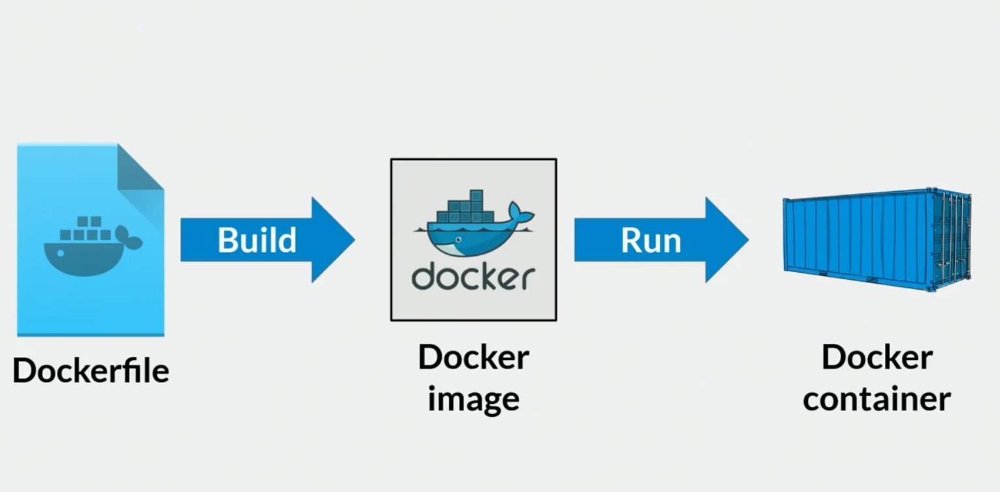
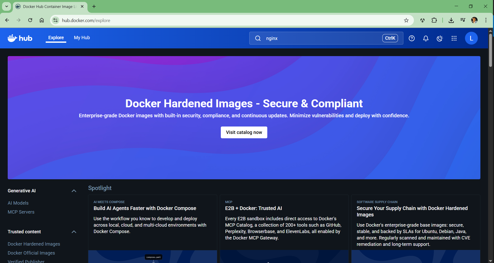
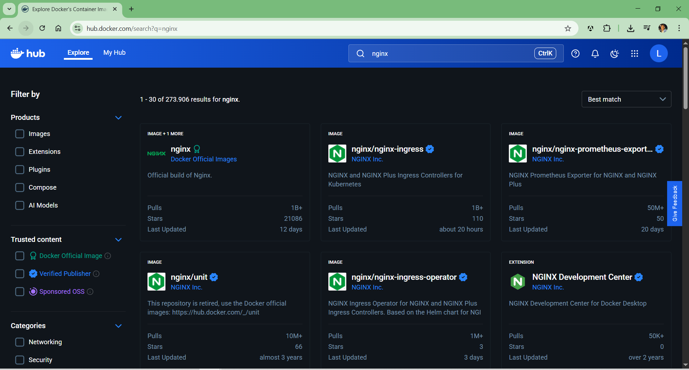
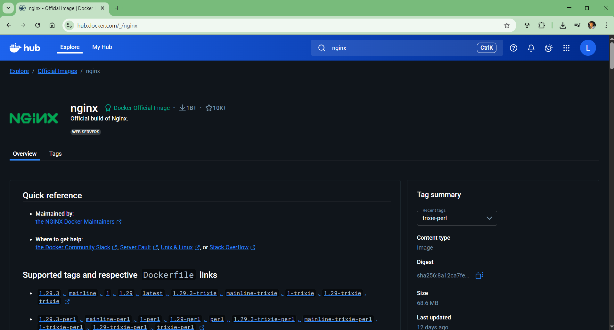

# Creación de Contenedores Web con Docker y Nginx en VS Code

El flujo de trabajo para llegar desde un archivo de Docker a un contenedor es el siguiente:



## Proyecto 01

Para continuar vamos a usar los recursos del proyecto 01.

Puedes usar la carpeta `sitio` del `proyecto-01`. Dentro de la carpeta `sitio` encontrarás un archivo `linktree.html`.

Para acceder al `proyecto-01`, haz clic aquí: <a href="https://github.com/LuisLavado/learning-docker/tree/main/proyectos/proyecto-01" target="_blank">Proyecto 01</a>

En la raíz del proyecto debes crear un archivo llamado `Dockerfile` (no tiene extensión), y para llenar éste archivo nos podemos ayudar de [Docker Hub](https://hub.docker.com/explore), allí buscamos "nginx":



Al dar **ENTER**, cargará una lista de imagenes, seleccionamos la primera **"Official build of Nginx."** que es la imagen oficial de **Nginx**:





Si deslizas hacia abajo entontrarás una sección **"How to use this image"** (How to use this image). Pero para efectos prácticos vamos a abrir nuestro `Dockerfile` y escribimos lo siguiente:

```
FROM nginx:latest

# Path: /usr/share/nginx/html
COPY /sitio /usr/share/nginx/html  
```

Para continuar vamos a la siguiente clase: [Creación y etiquetado de imágenes Docker desde Dockerfile](./07-creacion-de-imagenes-con-docker.md)
